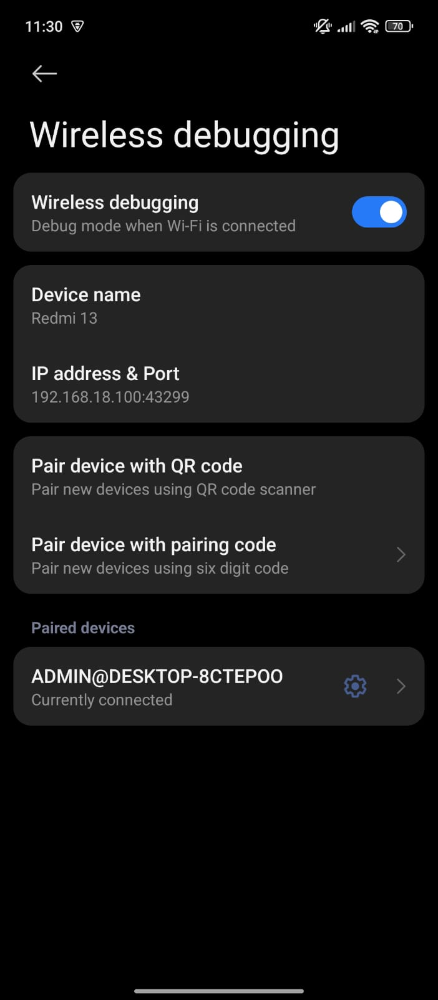

# LAPORAN PRAKTIKUM

## Praktikum 1: Membuat Project Flutter Baru   
### Langkah 1: Membuat Project Flutter Baru dan memilih Template Flutter 
   

### Langkah 2: Memilih Lokasi Project  
   

### Langkah 3: Membuat nama project hello_world 
   

### Langkah 4: Flutter Project berhasil dibuat  
   

## Praktikum 2: Menghubungkan Perangkat Android/Emulator
### Langkah 1: Mengaktifkan devops pada Handphone 
   

### Langkah 2: Menyalakan USB Debugging dan sambungkan perangkat Android ke komputer menggunakan kabel USB
   

### Langkah 3: Menyalakan Wireless Debugging
   

### Langkah 4: Melakukan pair and connects sesuai dengan pairing code dan IP addres - port
   
   

### Langkah 5: Scan QR Code dengan perangkat Android
   