# LAPORAN PRAKTIKUM

## Praktikum 1: Membuat Project Flutter Baru   
### Langkah 1: Membuat Project Flutter Baru dan memilih Template Flutter 
   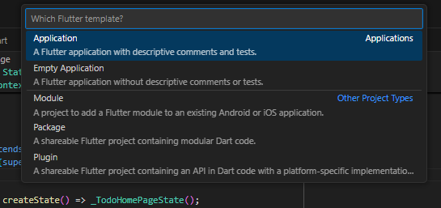

### Langkah 2: Memilih Lokasi Project  
   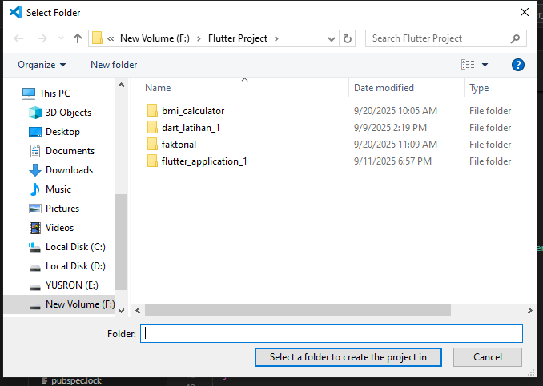

### Langkah 3: Membuat nama project hello_world 
   

### Langkah 4: Flutter Project berhasil dibuat  
   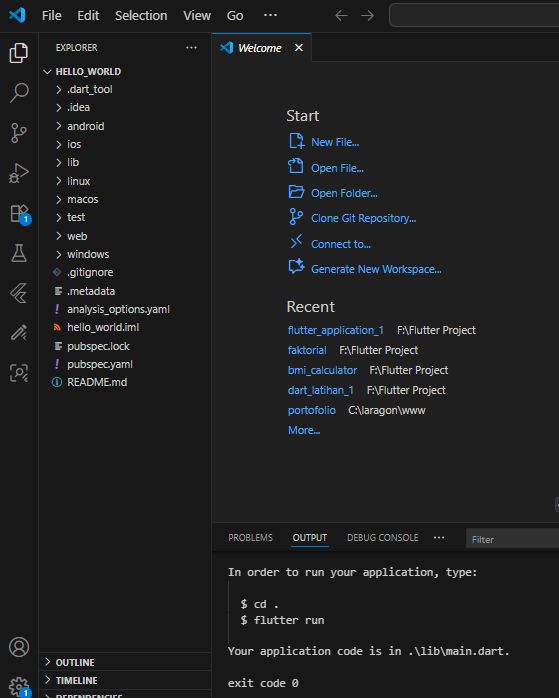

## Praktikum 2: Menghubungkan Perangkat Android/Emulator
### Langkah 1: Mengaktifkan devops pada Handphone 
   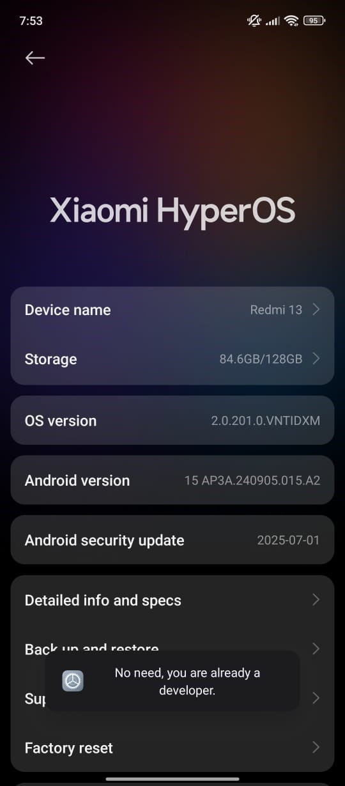

### Langkah 2: Menyalakan USB Debugging dan sambungkan perangkat Android ke komputer menggunakan kabel USB
   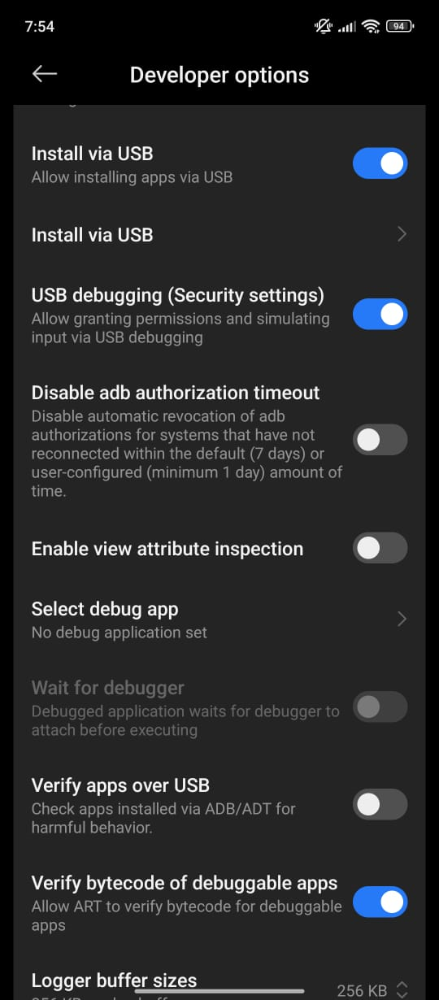

### Langkah 3: Menyalakan Wireless Debugging
   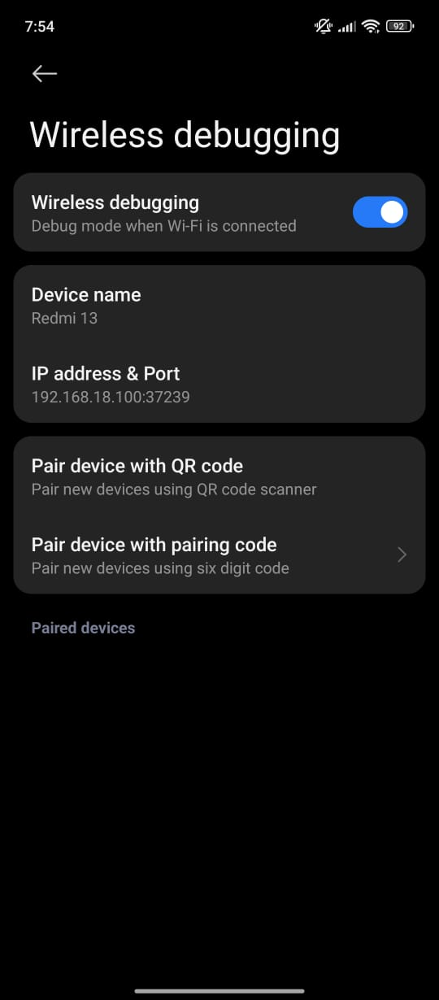

### Langkah 4: Melakukan pair and connects sesuai dengan pairing code dan IP addres - port diatas
   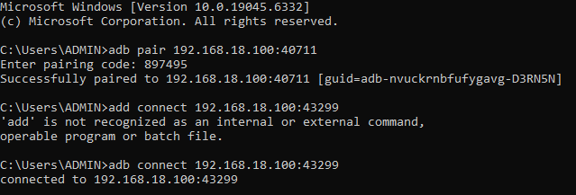

### Langkah 5: Hasil menjalankan flutter di Handphone
   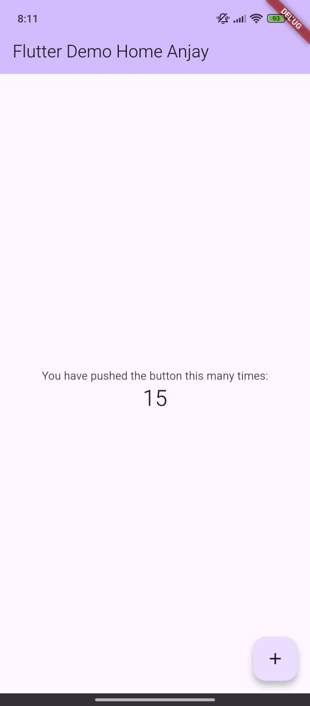

## Praktikum 3: Membuat Repository GitHub dan Laporan Praktikum
### Langkah 1-10: Membuat dan Remote Repository ke GitHub
   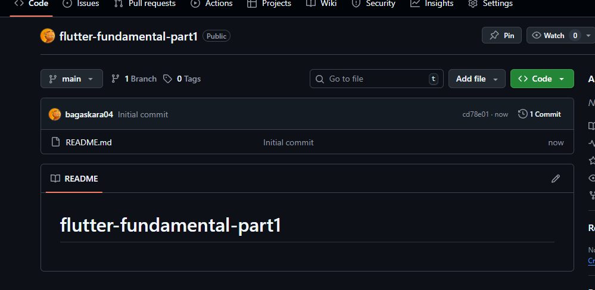
   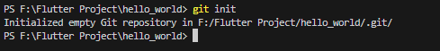
   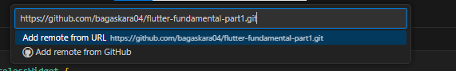
   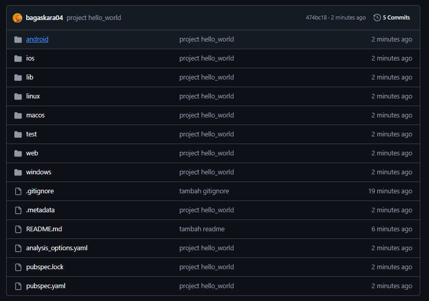

### Langkah 11: Menjalankan project hello_world via Chrome
   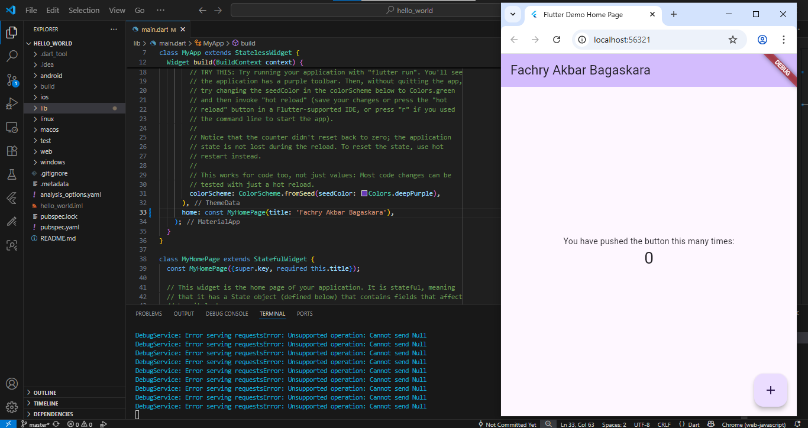

### Langkah 12: Menambahkan folder images dan mengubah Readme.md dengan hasil menampilkan teks nama lengkap
   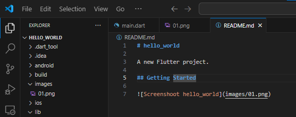
   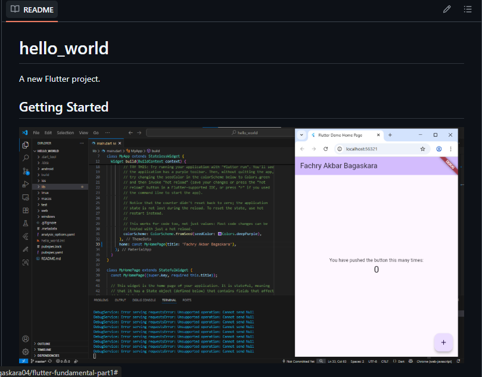

## Praktikum 4: Menerapkan Widget Dasar
### Langkah 1: Text Widget
   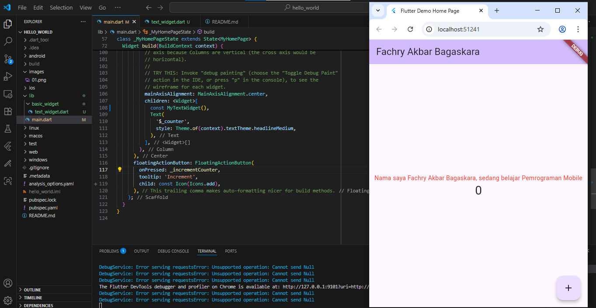

### Langkah 2: Image Widget
   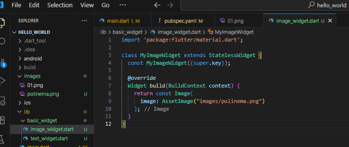
   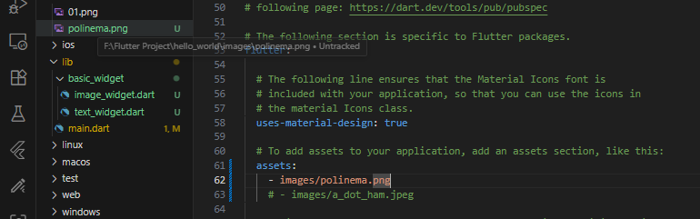
   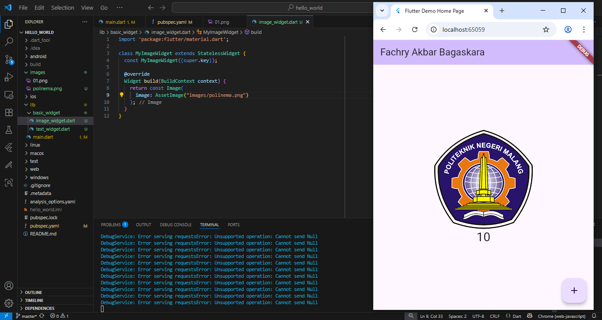