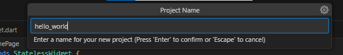

# LAPORAN PRAKTIKUM

## Praktikum 1: Membuat Project Flutter Baru   
### Langkah 1: Membuat Project Flutter Baru dan memilih Template Flutter 
   

### Langkah 2: Memilih Lokasi Project  
   

### Langkah 3: Memilih Nama Project  
   

### Langkah 4: Flutter Project berhasil dibuat  
   